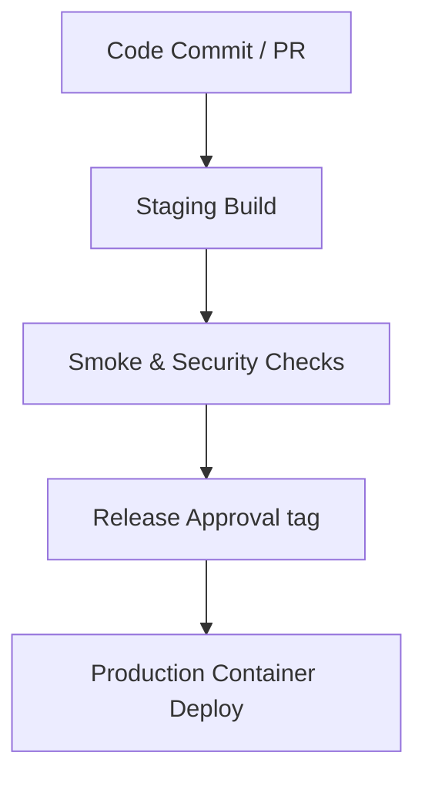

# E-Sevai SaaS - Release Process

This document details the semantic versioning schema and release pipeline for building, verifying, and launching E-Sevai updates.

---

## 1. Versioning Schema (SemVer)
We follow Semantic Versioning (`vMAJOR.MINOR.PATCH`):
- **MAJOR**: Incompatible API breaking changes.
- **MINOR**: Backward-compatible new features (e.g. adding WhatsApp notification provider).
- **PATCH**: Backward-compatible bug fixes and security hotfixes (e.g. index additions, dependency upgrades).

---

## 2. Release Lifecycle Stages



### Stage 1: Staging Check & Smoke Tests
1. Deploy build to a staging docker environment.
2. Run validation sweeps on all role matrix endpoints.
3. Validate `/health` outputs return connected states.

### Stage 2: Database Migration
1. Apply the database optimization migration script `/docs/migrations/01_database_optimizations.sql` to the production database via the SQL editor.
2. Confirm the schema cache reload triggers successfully.

### Stage 3: Tagging the Release
Tag the main branch commit with the target SemVer tag:
```bash
git tag -a v1.0.0 -m "Release version 1.0.0 production ready E-Sevai SaaS backend"
git push origin v1.0.0
```

### Stage 4: Production Deployment
1. Pull release tag into the production host.
2. Execute container rebuilds: `docker-compose up -d --build`.
3. Check structured application logs to confirm zero environment validation warnings or start failures.
