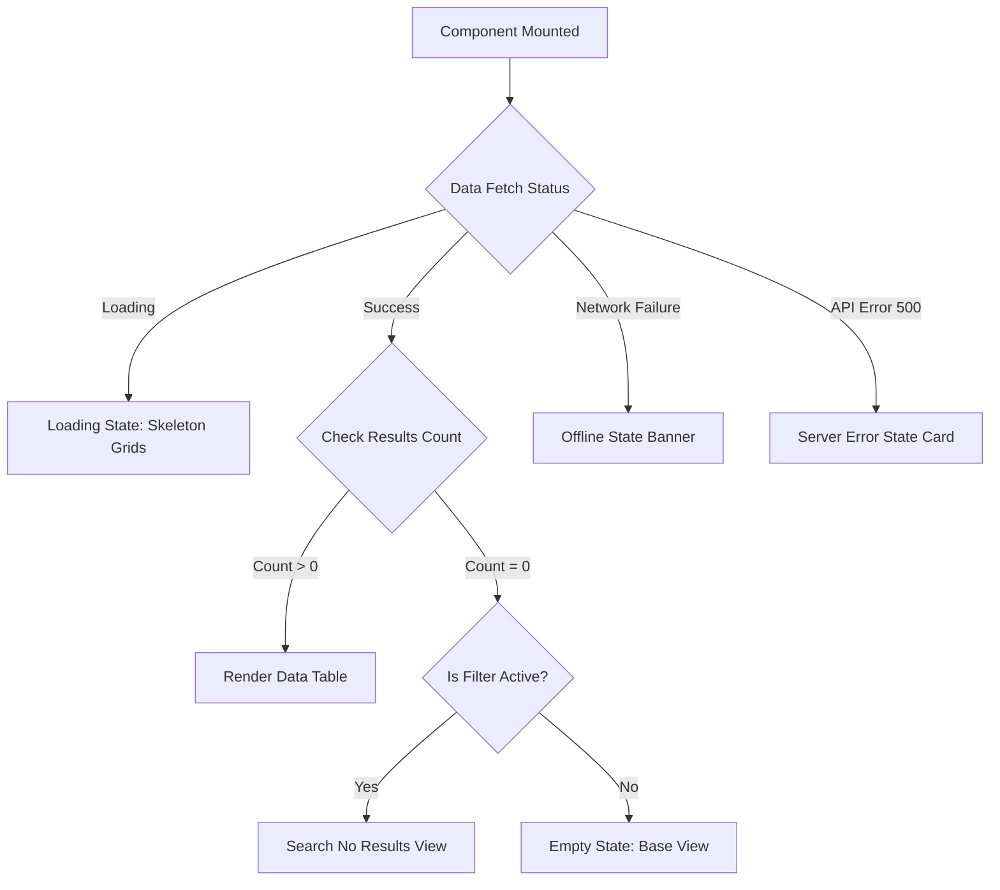

# E-Sevai SaaS - UI Component Library & State Standards

This document establishes the UI design guidelines, component inventories, responsive layout requirements, and interface state standards (loading, empty, error) optimized for E-Sevai operators.

---

## 1. Responsive Layout Requirements

E-Sevai operators often work on legacy desktop monitors (e.g. 1024x768 resolutions), tablets, or mobile devices in rural areas. The layout system is structured around fluid breakpoints:

| Viewport Profile | Grid Columns | Navigation | Form Inputs Width |
| :--- | :---: | :--- | :--- |
| **Desktop** (>= 1200px) | 12 | Fixed sidebar + top navbar. | Multi-column horizontal splits. |
| **Tablet** (768px - 1024px) | 8 | Collapsible sidebar overlay on tap. | Single column with inline icons. |
| **Mobile** (< 768px) | 4 | Mobile hamburger menu / bottom sheet navigation. | Full-width inputs stacked vertically. |

---

## 2. Component Inventory

### Layout Components
1. **Sidebar Navigation**: Nested role-based menu listings. Highlights the active path using high-contrast slate background states. Collapsible on smaller viewports.
2. **Navbar**: Contains global search bar, workspace selection toggles, network status indicators, and the Notification Bell widget.
3. **Notification Bell**: Toggles a floating popover displaying recent application assignments, verification queries, or receipts confirmations. Includes priority indicators (critical alerts in bold red badges).

### Data Tables & Controls
4. **DataTable**: Responsive table grid supporting multi-column sorting, row selection hooks, and responsive table scrolling.
5. **SearchBar**: Debounced input field (typically 300ms) with clean inline "Clear" controls.
6. **Filters Bar**: Collapsible panel containing dropdowns for date ranges, status filters, and center categories.
7. **Pagination**: Navigation buttons showing current page numbers, next/prev arrow buttons, and page-size selection options.

### Dialogs & Form Actions
8. **Modal Shell**: Keyboard-accessible dialog container centering form pages.
9. **Confirm Dialog**: Action-blocking modal for irreversible tasks (e.g. deleting staff accounts, rejecting applications).
10. **File Uploader**: Drag-and-drop file target displaying progress percentages, supported extensions list (PDF, JPG, PNG), and file size limitations warning labels.
11. **Document Previewer**: Side-by-side splits window inside application detail pages to allow managers to view uploaded documents and checklists without leaving the queue.

### Informational Visuals
12. **Status Badge**: Pill-shaped badges colored according to application/payment status:
    - `completed` / `verified`: Green
    - `submitted` / `assigned`: Blue
    - `pending_payment` / `draft`: Amber
    - `rejected` / `failed`: Red
13. **Dashboard Cards**: Key metrics containers displaying big numeric totals with visual trend lines (e.g. revenue, pending counts).
14. **Chart Components**: Lightweight SVG line and bar charts showing monthly application metrics and payment distributions.

---

## 3. UI State Standards

To maintain top-tier visual excellence and ensure the application remains clear and interactive, every core module must implement the following state wrappers:

### Loading State (Skeleton Grids)
* **Design Standard**: Instead of showing generic blocking spinner screens, elements fade-in using gray shimmer skeletons matching the size of the elements being loaded.
* **Component Example**: `SkeletonTable` displays 5 rows of pulsing gray rectangular bars matching headers.

### Empty State
* **Design Standard**: Used when a module contains no data records (e.g. no staff registered yet). Contains:
  - Vector line-art icon (non-distracting, thin lines).
  - Clear message: `"No Staff Members Invited Yet. Invite managers and operators to start processing applications."`
  - Action button: `"Invite Staff"` to initiate onboarding directly.

### Search No Results State
* **Design Standard**: Used when active user filter search matches nothing.
  - Message: `"No records match your query. Try adjusting your filter parameters or checking your spellings."`
  - Action button: `"Clear Search / Reset Filters"`.

### Permission Denied (403 Forbidden State)
* **Design Standard**: Centered secure warning panel block:
  - Message: `"Restricted Page: Your current role limits access to center financial records. Contact the platform administrator."`

### Offline State
* **Design Standard**: Displayed when internet connection is lost.
  - Action: Disables server-modifying submit buttons, adds standard warning headers to the layout shell, and alerts: `"Working Offline. Safe data saving is paused until connections resume."`

### Server Error State (500 Failures)
* **Design Standard**: Standard card message display containing:
  - Message: `"Something went wrong on our servers. The team has been notified. Support code: req_xxx."`
  - Action button: `"Refresh Page"`.
