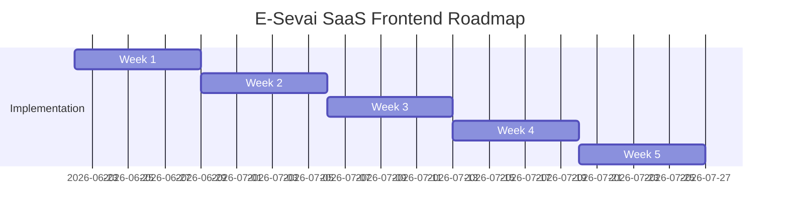

# E-Sevai SaaS - Frontend Implementation Roadmap

This 5-week schedule details the sequence of milestones, core objectives, and verification tests required to build, test, and deploy the React+Vite SPA frontend client.

---

## Weekly Milestones and Deliverables

---

### Week 1: Layouts & Authentication Systems
* **Objectives**: Scaffold the React+Vite project, configure basic design patterns, mount Zustand authentication stores, and establish private routing wrappers.
* **Deliverables**:
  - React project skeleton + package dependencies configurations.
  - Base theme definitions (CSS variables matching HSL templates).
  - Login form view with input validators.
  - Top Navbar, Sidebar menu layouts, and protected route shells.
* **QA Check**: Verify that unauthorized routes redirect users to `/login`.

### Week 2: Center Settings & Onboarding Controls
* **Objectives**: Implement the onboarding views, owner onboarding invitations page, and manager/staff listings directory tables.
* **Deliverables**:
  - Center registration form wizard `/centers/register`.
  - Pending approval dashboard cards for Platform Admins.
  - Staff invitation forms `/staff/invite` with role selector dropdowns.
  - Active staff list directory data grid showing status indicators (active, pending, revoked).
* **QA Check**: Verify that staff members can be successfully invited and listed under the active tenant ID.

### Week 3: Applications Lifecycle Forms
* **Objectives**: Develop catalog selectors, application submission wizards, details tracking interfaces, and historical activity logs.
* **Deliverables**:
  - Services catalog list selection cards `/services`.
  - Citizens applications creation forms with validator constraints.
  - Application details view showing current status, assigned staff, and progress timelines.
  - SLA timers displaying time remaining before breach limits.
* **QA Check**: Check that applications calculate due dates accurately upon selection.

### Week 4: Document Checklist Uploads & Payment Flows
* **Objectives**: Implement document checklist verifications, file drop controls, payment collection interfaces, and receipt generations.
* **Deliverables**:
  - Application checklist view rendering required documents.
  - Drag-and-drop file uploaders checking extension types and size.
  - Document reviewer side-by-side splits display (for manager verification).
  - Payments collect forms (Cash inputs calculator & UPI QR displays).
* **QA Check**: Verify files size checking prevents server request dispatching.

### Week 5: Dashboard Analytics, Reports & Production Release
* **Objectives**: Integrate charts components, reports download streams, perform security audits, build code, and finalize deployment.
* **Deliverables**:
  - Dashboard widget grids showing charts and counters.
  - Reports download forms returning CSV file downloads with UTF-8 BOM coding.
  - Mock API tests and UI automated script executions.
  - Production build generation (`npm run build`).
* **QA Check**: Verify production build executes cleanly without bundling failures.
