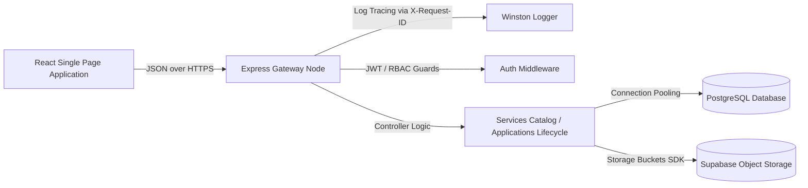

# E-Sevai SaaS - Project Handover Package

This handover package compiles the architectural summary, database design schema, API references, deployment strategies, and current limitations of the backend implementation to ensure smooth transition to frontend integration teams.

---

## 1. System Architecture Overview

The E-Sevai SaaS Platform is structured as a multi-tenant service using Node.js Express for controller routing, structured logging middleware, security guards, and PostgreSQL (via Supabase) for transactions persistence:



---

## 2. Database Schema Summary

The database uses PostgreSQL schemas configured for multi-tenant isolation. Core tables include:

```sql
-- Core Tenants
CREATE TABLE tenants (
    id VARCHAR(50) PRIMARY KEY,
    name VARCHAR(255) NOT NULL,
    status VARCHAR(50) DEFAULT 'pending',
    created_at TIMESTAMP WITH TIME ZONE DEFAULT CURRENT_TIMESTAMP
);

-- Users & Credentials
CREATE TABLE users (
    id UUID PRIMARY KEY DEFAULT uuid_generate_v4(),
    tenant_id VARCHAR(50) REFERENCES tenants(id),
    email VARCHAR(255) UNIQUE NOT NULL,
    password_hash VARCHAR(255) NOT NULL,
    role VARCHAR(50) CHECK (role IN ('platform_admin', 'center_owner', 'manager', 'staff')),
    name VARCHAR(255) NOT NULL,
    created_at TIMESTAMP WITH TIME ZONE DEFAULT CURRENT_TIMESTAMP
);

-- Applications Ledger
CREATE TABLE applications (
    id UUID PRIMARY KEY DEFAULT uuid_generate_v4(),
    application_number VARCHAR(100) UNIQUE NOT NULL,
    tenant_id VARCHAR(50) REFERENCES tenants(id),
    service_id VARCHAR(100) NOT NULL,
    status VARCHAR(50) DEFAULT 'draft',
    citizen_details JSONB NOT NULL,
    sla_due_date TIMESTAMP WITH TIME ZONE NOT NULL,
    created_at TIMESTAMP WITH TIME ZONE DEFAULT CURRENT_TIMESTAMP
);

-- Payments Registry
CREATE TABLE payments (
    id UUID PRIMARY KEY DEFAULT uuid_generate_v4(),
    application_id UUID REFERENCES applications(id),
    tenant_id VARCHAR(50) REFERENCES tenants(id),
    amount NUMERIC(10,2) NOT NULL,
    payment_method VARCHAR(50),
    payment_snapshot JSONB NOT NULL,
    collected_by UUID REFERENCES users(id),
    collected_at TIMESTAMP WITH TIME ZONE,
    created_at TIMESTAMP WITH TIME ZONE DEFAULT CURRENT_TIMESTAMP
);
```

---

## 3. Documentation Map & Guides References

* **API Documentation**: Interactive Swagger docs are hosted directly by the backend at [http://localhost:5000/api/docs](http://localhost:5000/api/docs) (served via CDN-embedded assets).
* **OpenAPI Specs Schema**: [openapi.json](file:///d:/E-Sevai_Saas/ESevai-SaaS/backend/src/config/openapi.json) lists the raw v3 schema mapping endpoints.
* **Deployment Guide**: See [deployment-guide.md](file:///d:/E-Sevai_Saas/ESevai-SaaS/docs/deployment-guide.md) for Docker Compose orchestration, SSL configuration, and environment setup guidelines.
* **Backup & Recovery**: Reference [backup-recovery-guide.md](file:///d:/E-Sevai_Saas/ESevai-SaaS/docs/backup-recovery-guide.md) for PostgreSQL automated snapshot dumps instructions.
* **Security Audit**: Audit details, security headers configuration, and rate-limiting patterns are cataloged in [security_audit.md](file:///d:/E-Sevai_Saas/ESevai-SaaS/docs/security_audit.md).

---

## 4. Known Limitations

1. **Local Report Compilations**: The sandbox system runs offline and does not download heavy binary compilers (e.g. `exceljs` or `pdfkit`). Reporting exports compile data directly into native CSV text streams using UTF-8 Byte Order Marks (BOM) to support direct Excel parses.
2. **In-Memory Rate Limiting**: The rate-limiter is currently configured to run in application memory space. If the backend scales horizontally (e.g. multiple container instances), rate limits will reset per container instance. Redis integration is recommended for clustered production deployments.

---

## 5. Recommended Future Enhancements

* **Redis Token Revocation Cache**: Cache revoked JWT IDs to allow instant global session terminations before token TTL expires.
* **UPI Dynamic QR Codes**: Integrate UPI deep links generating real-time dynamic QR codes on screens matching precise application billing values.
* **Push Notifications**: Replicate the SSE notifications system with Google Firebase Cloud Messaging (FCM) to support native push alerts on operator mobile screens.
